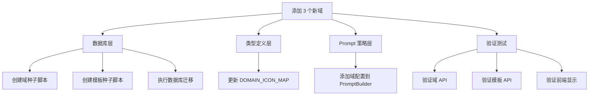
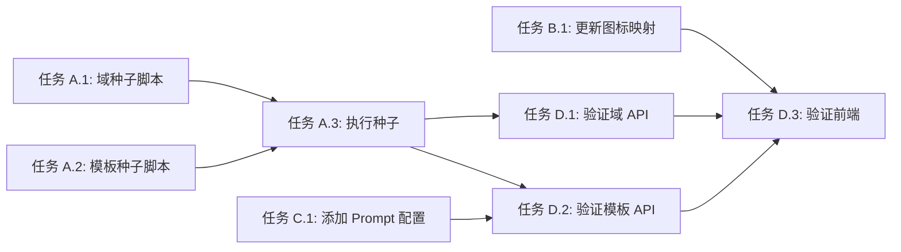

# 功能规划：添加 3 个新人物域（maternity、graduation、couple）

**规划时间**：2026-02-27
**预估工作量**：18 任务点

---

## 1. 功能概述

### 1.1 目标
为 ai-wedding 平台添加 3 个新的人物相关域，扩展平台的图片生成能力：
- **maternity** - AI 孕妇照（记录孕期美好时光）
- **graduation** - AI 毕业照（毕业季纪念，学士服写真）
- **couple** - AI 情侣写真（情侣合照，记录甜蜜时光）

### 1.2 范围
**包含**：
- 数据库层：在 `domains` 表中添加 3 个新域记录
- 类型定义层：更新 `DOMAIN_ICON_MAP` 添加 `GraduationCap` 图标
- 模板数据：为每个新域创建 5-8 个初始模板（包含 name, description, category, prompt_config, prompt_list, price_credits）
- Prompt 策略：确认现有 `PromptBuilder` 支持新域（无需创建新文件）

**不包含**：
- 前端 UI 组件修改（域列表动态从 API 获取，无需改动）
- API 路由修改（已支持动态域系统）
- 新的 Prompt 策略文件（使用统一的 `PromptBuilder`）

### 1.3 技术约束
- 技术栈：Next.js 14 + TypeScript + PostgreSQL + Prisma
- 域系统：动态域系统（从数据库读取，不依赖硬编码）
- Prompt 策略：使用统一的 `PromptBuilder` 类，配置驱动
- 图标库：Lucide React（需添加 `GraduationCap` 到 `DOMAIN_ICON_MAP`）
- 模板图片：使用 Pexels 或 Unsplash 的免费图片 URL

---

## 2. WBS 任务分解

### 2.1 分解结构图



### 2.2 任务清单

#### 模块 A：数据库层（8 任务点）

**文件**: `prisma/seed-new-domains.ts`（新建）

- [ ] **任务 A.1**：创建域种子数据脚本（3 点）
  - **输入**：域配置需求（slug, name, description, icon, color, require_face_detection）
  - **输出**：可执行的 TypeScript 种子脚本
  - **关键步骤**：
    1. 创建 `prisma/seed-new-domains.ts` 文件
    2. 定义 3 个域的配置数据（maternity, graduation, couple）
    3. 使用 `prisma.domains.upsert()` 确保幂等性
    4. 添加执行日志和错误处理

**文件**: `prisma/seed-new-templates.ts`（新建）

- [ ] **任务 A.2**：创建模板种子数据脚本（4 点）
  - **输入**：每个域 5-8 个模板的详细配置
  - **输出**：可执行的 TypeScript 种子脚本
  - **关键步骤**：
    1. 创建 `prisma/seed-new-templates.ts` 文件
    2. 为 maternity 域定义 6 个模板（不同场景：室内、户外、艺术风格）
    3. 为 graduation 域定义 6 个模板（不同场景：校园、图书馆、学士服风格）
    4. 为 couple 域定义 6 个模板（不同场景：约会、旅行、浪漫风格）
    5. 每个模板包含：name, description, category, domain, preview_image_url, prompt_config, prompt_list（5 条英文提示词）, price_credits（10-15）, is_active, sort_order
    6. 使用 `prisma.templates.upsert()` 确保幂等性

- [ ] **任务 A.3**：执行数据库种子脚本（1 点）
  - **输入**：完成的种子脚本
  - **输出**：数据库中新增的域和模板记录
  - **关键步骤**：
    1. 运行 `pnpm tsx prisma/seed-new-domains.ts`
    2. 运行 `pnpm tsx prisma/seed-new-templates.ts`
    3. 验证数据库记录（使用 Prisma Studio 或 SQL 查询）

#### 模块 B：类型定义层（2 任务点）

**文件**: `app/types/domain.ts`

- [ ] **任务 B.1**：更新 DOMAIN_ICON_MAP（2 点）
  - **输入**：新域需要的图标（GraduationCap）
  - **输出**：更新后的 `DOMAIN_ICON_MAP`
  - **关键步骤**：
    1. 从 `lucide-react` 导入 `GraduationCap` 图标
    2. 添加到 `DOMAIN_ICON_MAP` 对象：`GraduationCap: GraduationCap`
    3. 运行 `pnpm typecheck` 确保无类型错误

#### 模块 C：Prompt 策略层（3 任务点）

**文件**: `app/lib/prompt-strategies/prompt-builder.ts`

- [ ] **任务 C.1**：添加新域配置到 PromptBuilder（3 点）
  - **输入**：3 个新域的 Prompt 策略需求
  - **输出**：更新后的 `DEFAULT_CONFIGS` 对象
  - **关键步骤**：
    1. 在 `DEFAULT_CONFIGS` 中添加 `maternity` 配置：
       - role: "孕妇摄影风格分析师"
       - photoType: "孕妇照片"
       - requirements: ["保持人物五官特征", "温馨柔和的场景", "突出孕期美感", "5个提示词风格各异", "返回JSON格式"]
    2. 在 `DEFAULT_CONFIGS` 中添加 `graduation` 配置：
       - role: "毕业照摄影风格分析师"
       - photoType: "毕业照片"
       - requirements: ["保持人物五官特征", "学士服或校园场景", "青春活力的氛围", "5个提示词风格各异", "返回JSON格式"]
    3. 在 `DEFAULT_CONFIGS` 中添加 `couple` 配置：
       - role: "情侣摄影风格分析师"
       - photoType: "情侣照片"
       - requirements: ["保持双方人物五官特征", "浪漫甜蜜的场景", "互动姿势自然", "5个提示词风格各异", "返回JSON格式"]
    4. 更新 `getStyleDescription()` 方法的 `styleMap` 添加新域描述
    5. 运行 `pnpm typecheck` 确保无类型错误

#### 模块 D：验证测试（5 任务点）

- [ ] **任务 D.1**：验证域 API（2 点）
  - **输入**：完成的数据库种子
  - **输出**：API 返回新域数据
  - **关键步骤**：
    1. 启动开发服务器：`pnpm dev`
    2. 调用 `GET /api/domains` 验证返回 11 个域（原 8 个 + 新 3 个）
    3. 检查新域的 slug, name, icon, color, require_face_detection 字段
    4. 验证 `require_face_detection` 均为 `true`

- [ ] **任务 D.2**：验证模板 API（2 点）
  - **输入**：完成的模板种子
  - **输出**：API 返回新域的模板
  - **关键步骤**：
    1. 调用 `GET /api/templates?domain=maternity` 验证返回 6 个模板
    2. 调用 `GET /api/templates?domain=graduation` 验证返回 6 个模板
    3. 调用 `GET /api/templates?domain=couple` 验证返回 6 个模板
    4. 检查每个模板的 prompt_list 包含 5 条英文提示词

- [ ] **任务 D.3**：验证前端显示（1 点）
  - **输入**：完成的 API 验证
  - **输出**：前端正确显示新域
  - **关键步骤**：
    1. 访问首页 `/` 验证域卡片显示 11 个域
    2. 验证新域的图标、颜色、描述正确显示
    3. 点击新域卡片，验证跳转到 `/templates/[domain]` 页面
    4. 验证模板列表正确显示

---

## 3. 依赖关系

### 3.1 依赖图



### 3.2 依赖说明

| 任务 | 依赖于 | 原因 |
|------|--------|------|
| 任务 A.3 | 任务 A.1, A.2 | 需要先完成种子脚本才能执行 |
| 任务 D.1 | 任务 A.3 | 需要数据库中有域记录 |
| 任务 D.2 | 任务 A.3, C.1 | 需要数据库中有模板记录，且 Prompt 策略已配置 |
| 任务 D.3 | 任务 B.1, D.1, D.2 | 需要图标映射、API 数据都准备好 |

### 3.3 并行任务

以下任务可以并行开发：
- 任务 A.1 ∥ 任务 A.2 ∥ 任务 B.1 ∥ 任务 C.1
- 任务 D.1 ∥ 任务 D.2（API 验证可并行）

---

## 4. 实施建议

### 4.1 技术选型

| 需求 | 推荐方案 | 理由 |
|------|----------|------|
| 种子脚本执行 | `pnpm tsx` | 直接执行 TypeScript，无需编译 |
| 模板预览图 | Pexels/Unsplash | 免费高质量图片，无版权问题 |
| 图标库 | Lucide React | 项目已使用，风格统一 |
| Prompt 策略 | 统一 PromptBuilder | 避免重复代码，配置驱动 |

### 4.2 潜在风险

| 风险 | 影响 | 缓解措施 |
|------|------|----------|
| 模板图片 URL 失效 | 中 | 使用稳定的图片托管服务（Pexels/Unsplash），或上传到 MinIO |
| Prompt 策略不适配新域 | 中 | 在 `DEFAULT_CONFIGS` 中精心设计 requirements，测试生成效果 |
| 图标名称拼写错误 | 低 | 从 Lucide 官网复制准确的图标名称 |
| 种子脚本重复执行 | 低 | 使用 `upsert()` 确保幂等性 |

### 4.3 测试策略

- **数据库验证**：使用 Prisma Studio 或 SQL 查询验证记录
- **API 测试**：使用 curl 或 Postman 调用 API 端点
- **前端测试**：手动浏览器测试，验证 UI 显示和交互
- **类型检查**：运行 `pnpm typecheck` 确保无类型错误
- **Lint 检查**：运行 `pnpm lint` 确保代码规范

---

## 5. 验收标准

功能完成需满足以下条件：

- [ ] 数据库中新增 3 个域记录（maternity, graduation, couple）
- [ ] 数据库中新增 18 个模板记录（每个域 6 个）
- [ ] `DOMAIN_ICON_MAP` 包含 `GraduationCap` 图标
- [ ] `PromptBuilder` 的 `DEFAULT_CONFIGS` 包含 3 个新域配置
- [ ] `GET /api/domains` 返回 11 个域
- [ ] `GET /api/templates?domain=maternity` 返回 6 个模板
- [ ] `GET /api/templates?domain=graduation` 返回 6 个模板
- [ ] `GET /api/templates?domain=couple` 返回 6 个模板
- [ ] 首页正确显示 11 个域卡片
- [ ] 点击新域卡片可跳转到模板列表页
- [ ] 无 TypeScript 类型错误（`pnpm typecheck` 通过）
- [ ] 无 ESLint 错误（`pnpm lint` 通过）

---

## 6. 详细实施数据

### 6.1 域配置数据

```typescript
// prisma/seed-new-domains.ts
const newDomains = [
  {
    slug: 'maternity',
    name: 'AI 孕妇照',
    description: '记录孕期美好时光，专业孕妇写真',
    icon: 'Baby',
    color: 'from-pink-400 to-rose-400',
    require_face_detection: true,
    is_active: true,
    sort_order: 8,
  },
  {
    slug: 'graduation',
    name: 'AI 毕业照',
    description: '毕业季纪念，学士服写真',
    icon: 'GraduationCap',
    color: 'from-blue-400 to-indigo-500',
    require_face_detection: true,
    is_active: true,
    sort_order: 9,
  },
  {
    slug: 'couple',
    name: 'AI 情侣写真',
    description: '情侣合照，记录甜蜜时光',
    icon: 'Heart',
    color: 'from-rose-400 to-pink-500',
    require_face_detection: true,
    is_active: true,
    sort_order: 10,
  },
];
```

### 6.2 模板配置示例（maternity 域）

```typescript
// prisma/seed-new-templates.ts - maternity 模板示例
{
  name: '温馨孕妇照',
  description: '室内温馨风格孕妇写真',
  category: 'indoor',
  domain: 'maternity',
  preview_image_url: 'https://images.pexels.com/photos/1556652/pexels-photo-1556652.jpeg?auto=compress&cs=tinysrgb&w=800',
  prompt_config: { basePrompt: 'maternity photography' },
  prompt_list: [
    'A beautiful pregnant woman in a flowing white dress, standing by a window with soft natural light, gentle smile, serene atmosphere, professional maternity photography',
    'Elegant maternity portrait, expectant mother in a cream-colored gown, cradling her belly, warm studio lighting, soft focus background, intimate and peaceful mood',
    'Outdoor maternity photoshoot, pregnant woman in a floral dress walking in a garden, golden hour lighting, natural and joyful expression, dreamy bokeh effect',
    'Artistic maternity photo, silhouette of a pregnant woman against a sunset sky, dramatic lighting, emotional and powerful composition',
    'Cozy indoor maternity session, expectant mother sitting on a bed with soft pillows, wearing a knit sweater, warm and comfortable atmosphere, natural light from window',
  ],
  price_credits: 12,
  is_active: true,
  sort_order: 1,
}
```

### 6.3 PromptBuilder 配置示例

```typescript
// app/lib/prompt-strategies/prompt-builder.ts - DEFAULT_CONFIGS 新增
maternity: {
  role: '孕妇摄影风格分析师',
  photoType: '孕妇照片',
  requirements: [
    '保持人物五官特征不变',
    '温馨柔和的场景（室内、户外花园、海边等）',
    '突出孕期美感和母性光辉',
    '5个提示词风格各异（温馨、艺术、自然等）',
    '返回JSON格式',
  ],
},
graduation: {
  role: '毕业照摄影风格分析师',
  photoType: '毕业照片',
  requirements: [
    '保持人物五官特征不变',
    '学士服或校园场景（图书馆、操场、教学楼等）',
    '青春活力的氛围，展现毕业喜悦',
    '5个提示词风格各异（正式、活泼、怀旧等）',
    '返回JSON格式',
  ],
},
couple: {
  role: '情侣摄影风格分析师',
  photoType: '情侣照片',
  requirements: [
    '保持双方人物五官特征不变',
    '浪漫甜蜜的场景（约会地点、旅行景点、咖啡馆等）',
    '互动姿势自然（牵手、拥抱、对视等）',
    '5个提示词风格各异（浪漫、文艺、活泼等）',
    '返回JSON格式',
  ],
},
```

---

## 7. 执行命令清单

```bash
# 1. 创建并执行域种子脚本
pnpm tsx prisma/seed-new-domains.ts

# 2. 创建并执行模板种子脚本
pnpm tsx prisma/seed-new-templates.ts

# 3. 类型检查
pnpm typecheck

# 4. Lint 检查
pnpm lint

# 5. 启动开发服务器
pnpm dev

# 6. 验证 API（在另一个终端）
curl http://localhost:3000/api/domains
curl http://localhost:3000/api/templates?domain=maternity
curl http://localhost:3000/api/templates?domain=graduation
curl http://localhost:3000/api/templates?domain=couple

# 7. 打开 Prisma Studio 验证数据
pnpm prisma studio
```

---

## 8. 后续优化方向（可选）

Phase 2 可考虑的增强：
- 为每个新域添加更多模板（达到 15-20 个）
- 优化 Prompt 策略，根据实际生成效果调整 requirements
- 添加域级别的配置管理后台（允许管理员动态调整域配置）
- 为新域添加专属的 UI 主题色和图标动画
- 收集用户反馈，优化模板的 prompt_list 质量
